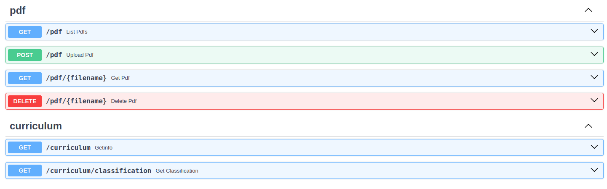
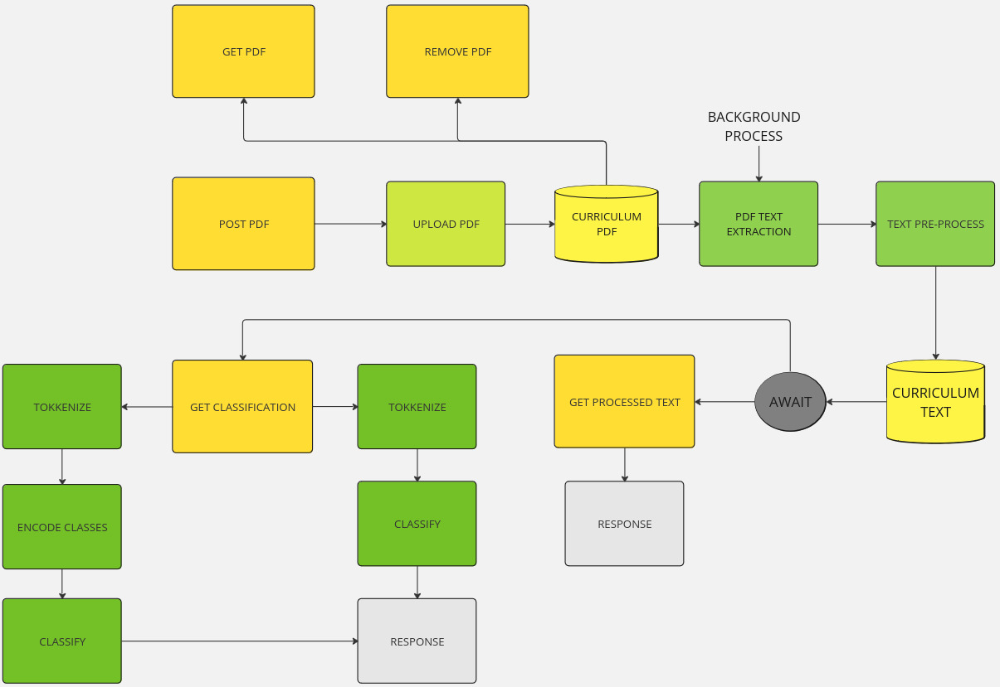
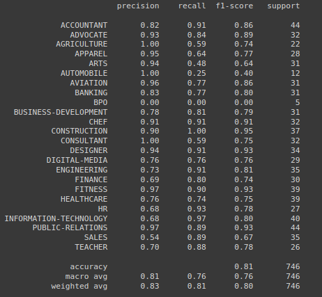
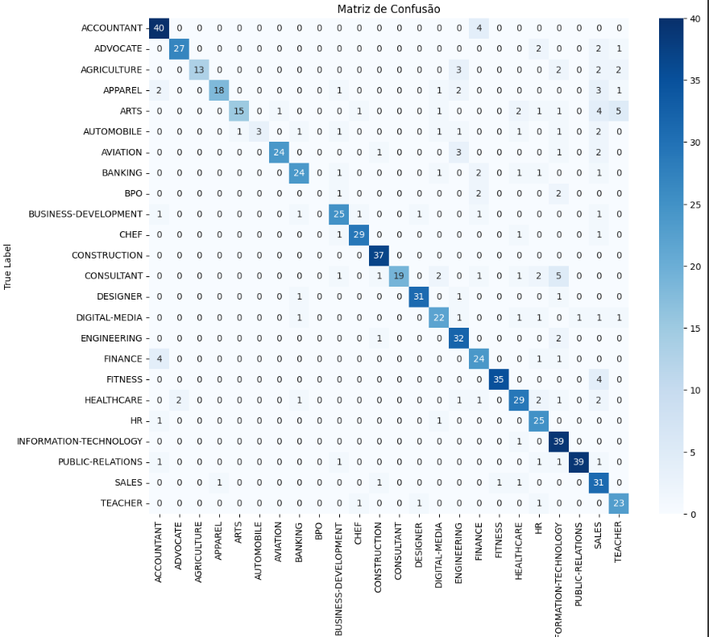
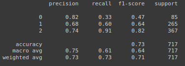
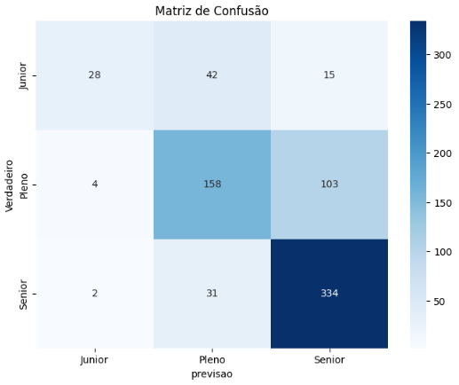

# Machine Learning Curriculum Classifier API
    Curriculum Classifier -Natural Language Process- API designed to process resumes in PDF format, extract text, perform seniority classification, classify the curriculum job area with machine learning methods and provide a detailed analysis of the resume content.   
    Built with the FastAPI framework, it incorporates various services for PDF manipulation and analysis.
&nbsp;
&nbsp;
&nbsp;
&nbsp;
&nbsp;
# Table of contents
- [Featrures](#features)
- [Getting Started](#getting-started)
- [API](#api)
- [Machine Learning Graphics](#machine-learning-graphics)
- [Contribute](#contribute)

# Features
- Curriculum PDF Process
    -
    - Pdf Text Extraction
        - library: PdfToText
    - PdF Text Pre-process
        - library: Spacy
        - pipeline:
            + lemmatizer
            + stopWord extraction
            + punct extraction
            + allows only alpha
            + to lower case
    - Background Processing of PDF Uploads
        - When a PDF is uploaded to the API, it undergoes a series of background processing steps to ensure efficient handling and analysis.
        - After uploading, the API processes the PDF text in the background, so when the text is requested, it is already ready. 
    - Dataeset
        - https://www.kaggle.com/datasets/danicardeal/resume-occupation-and-seniority

- Machine Learning Curriculum Classifier
    - 
    - Vectorization
        - Count vectorizer
    - Machine Learning
        - Random Forest Classifier
        - Accuracy
            - Job model = 81%
            - Seniority model = 72%

# Getting Started
TODO: Guide users through getting your code up and running on their own system. In this section you can talk about:
- ## Envirement preparation
    1.	Prepare Libraries:
    
            pip install -r ./configure/requirements.txt
    2.  Run:
    
            uvicorn application:app --reload
    3.	API references

- ## Use Instruction
    1. Open http://127.0.0.1:8000

    2. Upload Curriculum PDF
        - EndPoint 'POST /pdf' 
    3. Requests
        - Processed Text
            - EndPoint 'GET /curriculium'
            - Retuns:
                - Processed pdf text
        - Curriculum Classification
            - EndPoint 'GET /
            curriculum/classification'
            - Returns:
                - Job Area
                - Probability
                - Seniority Classification
                - Probability
                - Response
                    
                       {
                        "classification":
                        "classification probabilities"
                        "seniority":
                        "seniority probabilities": 
                        }
        - Model Classification Areas

                BUSINESS-DEVELOPMENT     
                INFORMATION-TECHNOLOGY   
                FINANCE                  
                CHEF                     
                ACCOUNTANT               
                ADVOCATE                 
                ENGINEERING              
                AVIATION                 
                FITNESS                  
                SALES                    
                HEALTHCARE               
                CONSULTANT               
                BANKING                  
                CONSTRUCTION             
                PUBLIC-RELATIONS         
                HR                       
                DESIGNER                 
                ARTS                     
                TEACHER                  
                APPAREL                  
                DIGITAL-MEDIA            
                AGRICULTURE              
                AUTOMOBILE               
                BPO
    ### note:
        Please be aware that the classification models integrated into our API are designed to classify resumes written exclusively in English.
            Resumes in other languages will not be accurately processed or classified by the current models.
# API
- ## Layout
    
- ## EndPoints
    - '/pdf'

            GET
            GET /{filename} - get specific pdf by id
            POST
            DELETE
    - '/curriculum'
            
            GET
            GET /classification - Get the curriculum classification
- ## Flowchart
    - 

# Machine Learning Graphics
- Job
    1. Job Classifier classification report 
    - 
    2. Job Classifier Confusion Matrix
    - 

- Seniority

    1. Seniority Classifier classification report
    - 

    2. Seniority Classifier Confusion Matrix
    - 

# Contribute

- [GitHub](https://github.com/Luankaio)
- [Linkedin](https://www.linkedin.com/in/luan-silveira-a6b73b286/)
    ## Contributors
    - ### [Luan Silveira](https://www.linkedin.com/in/luan-silveira-a6b73b286/)
        - [Linkedin](https://www.linkedin.com/in/luan-silveira-a6b73b286/)
        - [GitHub](https://github.com/Luankaio)
    - ### [Caio Coutinho](https://www.linkedin.com/in/caio-coutinho-2396b3287/)
        - [Linkedin](https://www.linkedin.com/in/caio-coutinho-2396b3287/)
        - [GitHub](https://github.com/caiocoutinhoo)

### [(Back to top)](#machine-learning-curriculum-classifier-api)